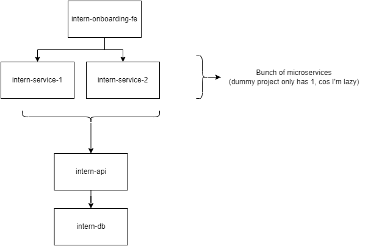

# intern-onboarding-be
## Table of Content
1. [Introduction](#1-introduction)   
   1.1. [JDK version. Read this first!](#11-jdk-version)
2. [Top Level Architecture](#2-top-level-architecture)
3. [Developer Guide](#3-developer-guide)  
   3.1. [Code Repository Structure](#31-code-repository-structure)   
   3.2. [Running Locally](#32-running-locally)
4. [API Documentation](#4-api-documentation)
5. [Git Branching Strategy](#5-git-branching-strategy)
6. [Disclaimer](#6-disclaimer)
         


## 1. Introduction
This repository is a small mono-repo demonstrating typically how we create our Spring Boot Projects (structure-wise)

It leaves alot of Spring Boot core features like `@Bean, @ConfigurationProperties` as well as other Spring Boot modules like Spring Data Jpa.<br/>
That's why I want to emphasize this is a **dummy** project for onboarding purposes only.

### 1.1. JDK version
In case, you work on this project from scratch.
Take note that it uses Spring Boot 2.7.9 and uses JDK 11. <br/>

If you're using Spring Boot 3.0.0, the minimum is JDK 17. <br/>
This means that if you copy & paste code from develop branch, it might not work and break cos the dependency versions in POM also has to change.

## 2. Top Level Architecture


## 3. Developer Guide
### 3.1 Code Repository Structure
The repository is a **monorepo** made up of the following folders:
```
intern-onboarding-be/
  - deployment/                    
    - docker-compose/           ## docker-compose orchestration files for local deployment
      - ...any sub folders               
      - docker-compose.yml           
    - kubernetes/               ## **Not implemented yet**
      - helm-charts             ## Top Level Helm Chart Packaging
        - charts                ## sub charts
        Chart.yaml              
        values.yaml
      values.xxxx.yaml          ## values.yaml for different deployment environment
  - documentation/              ## Folder containing assets for documentation purpose
  - intern-service              ## Service that frontend communicates to
  - intern-api                  ## API that service communicates to
  - intern-db                   ## Containerized DBs
```
### 3.2. Running Locally
We have to document the ports to forward traffic to containers since Docker is a watered-down orchestration tool meant purely for quick & cheap  local testing

| Service        | Description                                                    | Host Machine Port | Container Port |
|----------------|----------------------------------------------------------------|-------------------|----------------|
| intern-service | Communication endpoint by imaginery frontend yet to be created | 10000             | 8080           |
| intern-api     | API for all backend services like `intern-service` to talk to  | 10001             | 8081           |
| intern-db      | MySql instance for use by `intern-api`                         | 10002             | 3306           |

To run:
```
docker compose -p intern-onboarding-be -f deployment/docker-compose/docker-compose.yml --profile core-services --profile databases up -d
```
- Now try to access `intern-api` endpoint such as `localhost:10001/findAll`. 
- An empty array should be returned unless your db is populated has an existing persistent volume with data attached to it
  - If so, try the [handy tips](#handy-tips)
- **Note** : By right, you should access `intern-service` endpoint instead of `intern-api` endpoint. I just said to access `intern-api` for illustration.
- Try using `intern-service` instead
<br/>

To stop:
```
docker compose -p intern-onboarding-be -f deployment/docker-compose/docker-compose.yml --profile core-services --profile databases down
```
#### Handy tips:
- `docker system prune --volumes` to start with a fresh db instance
- Appending `--build` to `docker compose` command to create your containers fresh from Dockerfile

### 4. API Documentation
- If running locally via `docker-compose`:
  - `intern-api`: `localhost:10001/swagger-ui.html`
  - `intern-service`: `localhost:10000/swagger-ui.html`
- If running locally via by running all the service manually:
  - `intern-api`: `localhost:8081/swagger-ui.html`
  - `intern-service`: `localhost:8080/swagger-ui.html`
- If production level:
  - `intern-api`: `https://idkBroINvrDeployYet/swagger-ui.html`
  - `intern-service`: `https://idkBroINvrDeployYet/swagger-ui.html`

### 5. Git Branching Strategy
This project deviates from the standard [Git Branching](https://wiki.eniot.io/pages/viewpage.action?pageId=87143811) strategy <br/>
This is because the `develop` branch is not meant to be merged into unless there're improvements to be made.

Instead do this:
- Create a new branch based on `new-base-branch` with the following naming: `develop-<yourName>`
- Feature, hotfix,bugfix branches should be merged into `develop-<yourName>` branch and must have following naming
  - `feature-<feature-name>-descriptionOfFeature` for new features
  - `bugfix-<bug-name>-descriptionOfBugFix` for bug fixes
  - `hotfix-<hotfix-name>-descriptionOfHotFix` for hot fixes

### 6. Disclaimer
This is work-in-progress. Feel free to update the readme.md if it's value-adding :)

Hello x2